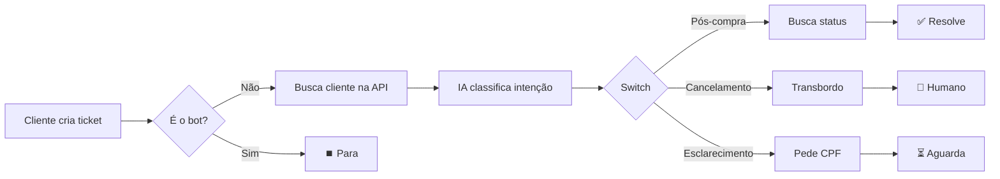

# 🤖 Fluxo de Suporte Pós-Venda - N8N

Este documento explica como configurar e usar o workflow de automação de suporte pós-venda criado para o N8N.

## 📋 Visão Geral

O fluxo automatiza o atendimento de tickets do Zendesk usando IA para:
- **Classificar intenções** do cliente
- **Buscar informações** em APIs externas
- **Gerar respostas** automáticas ou fazer transbordo inteligente para humanos

## 🔧 Pré-requisitos

Antes de importar o workflow, você precisa:

### 1. Credenciais do Zendesk
- Acesso à API do Zendesk
- Criar credenciais no N8N do tipo "Zendesk API"

### 2. Credenciais de IA (OpenAI)
- API Key do OpenAI (para os nós de IA)
- Criar credenciais no N8N do tipo "OpenAI API"

### 3. API de Backend
- Endpoint `/clientes/buscar` - para buscar dados do cliente
- Endpoint `/pedidos/status` - para buscar status do pedido
- Autenticação via HTTP Header

### 4. Variáveis de Ambiente

Configure as seguintes variáveis de ambiente no N8N:

```bash
# API Backend
API_BASE_URL=https://sua-api.com.br/api/v1

# IDs do Zendesk
LIA_BOT_ID=123456789  # ID do bot Lia no Zendesk
RETENTION_TEAM_ID=987654321  # ID do grupo de retenção

# IDs de Campos Customizados do Zendesk
CUSTOM_FIELD_PRIORITY_ID=360001234567
CUSTOM_FIELD_CATEGORY_ID=360007654321
```

## 📥 Importação do Workflow

1. Abra o N8N
2. Clique em **"Import from File"**
3. Selecione o arquivo `fluxo-suporte-pos-venda.json`
4. Configure as credenciais em cada nó

## 🔀 Estrutura do Fluxo

### Gatilhos (Triggers)
```
▶️ Zendesk On Ticket Create  ─┐
                              ├─→ Merge
▶️ Zendesk On Ticket Update  ─┘
```

### Orquestração Principal
```
Merge → Set (Extrair Dados) → IF (Trava) → HTTP (Buscar Cliente) → IA (Classificar)
                                    ↓
                              🛑 Parar (se for bot)
```

### Roteamento por Intenção (Switch)
O fluxo se divide em 3 caminhos:

#### 🔵 Caminho A: JORNADA_PÓS_COMPRA
```
HTTP (Buscar Status) → IA (Gerar Resposta) → Zendesk (Enviar Público)
Status: SOLVED ✅
```
**Exemplo:** Cliente pergunta "Onde está meu pedido?"

#### 🟠 Caminho B: RETENÇÃO_CANCELAMENTO
```
IA (Nota Interna) → Zendesk (Transbordo)
Status: OPEN → Atribuído ao time de retenção 👤
```
**Exemplo:** Cliente quer cancelar o pedido

#### 🟡 Caminho C: NECESSITA_ESCLARECIMENTO
```
Zendesk (Pedir CPF)
Status: PENDING ⏳
```
**Exemplo:** Cliente não forneceu dados suficientes

## 🎯 Prompts de IA

### Prompt 1: Classificação de Intenção
- **Modelo:** GPT-4 Turbo
- **Temperature:** 0.2 (mais determinístico)
- **Saída:** Uma das 3 intenções

### Prompt 2: Nota de Transbordo
- **Modelo:** GPT-4 Turbo
- **Temperature:** 0.5 (balanceado)
- **Saída:** Nota interna estruturada com urgência

### Prompt 3: Resposta de Status
- **Modelo:** GPT-4 Turbo
- **Temperature:** 0.7 (mais criativo)
- **Saída:** Resposta empática e profissional

## 🛡️ Trava de Segurança

O nó **IF: Trava de Segurança** previne loops infinitos:
- Verifica se o último comentário foi feito pelo bot (LIA)
- Se sim: **para o fluxo** ⏹️
- Se não: **continua o processamento** ✅

## 📊 Campos Extraídos do Ticket

O nó **Set** extrai:
- `ticket_id` - ID do ticket
- `ticket_subject` - Assunto
- `ticket_description` - Descrição
- `ticket_status` - Status atual
- `requester_email` - Email do solicitante
- `requester_name` - Nome do solicitante
- `latest_comment_author_id` - ID do autor do último comentário

## 🔄 Fluxo Completo (Exemplo)



## 🧪 Testando o Workflow

1. **Ative o workflow** no N8N
2. **Crie um ticket de teste** no Zendesk com:
   - Assunto: "Onde está meu pedido #12345?"
   - Descrição: "Comprei há 3 dias e não recebi atualização"
3. **Verifique**:
   - O workflow foi acionado
   - A IA classificou como JORNADA_PÓS_COMPRA
   - Uma resposta pública foi enviada
   - O ticket foi marcado como SOLVED

## 🚨 Troubleshooting

### Erro: "Credenciais inválidas"
- Verifique se as credenciais do Zendesk e OpenAI estão corretas
- Teste a conexão individualmente em cada nó

### Erro: "API não encontrada"
- Confirme se a variável `API_BASE_URL` está configurada
- Teste os endpoints da API manualmente (Postman/cURL)

### Loop Infinito
- Verifique se `LIA_BOT_ID` está configurado corretamente
- Certifique-se de que a trava de segurança está ativa

### IA não classifica corretamente
- Ajuste a temperature do modelo
- Refine os prompts com exemplos mais específicos
- Considere usar few-shot learning

## 📈 Métricas Sugeridas

Monitore:
- Taxa de resolução automática (Caminho A)
- Taxa de transbordo (Caminho B)
- Tempo médio de resposta
- Satisfação do cliente (CSAT)

## 🔐 Segurança

- **Nunca** commite credenciais no código
- Use variáveis de ambiente para dados sensíveis
- Configure permissões adequadas no Zendesk
- Monitore logs para detectar abusos

## 📝 Manutenção

**Revisar mensalmente:**
- Acurácia da classificação de IA
- Prompts e respostas geradas
- Endpoints de API (mudanças)
- Performance do workflow

## 🤝 Suporte

Para dúvidas ou problemas:
1. Verifique os logs do N8N
2. Revise este documento
3. Teste cada nó individualmente
4. Entre em contato com a equipe de desenvolvimento

---

**Versão:** 1.0.0  
**Última atualização:** 03/11/2025  
**Autor:** Agente de Automação
