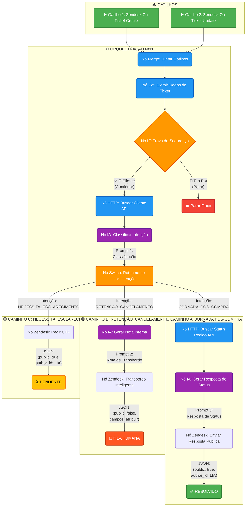

# 📊 Diagrama Visual do Fluxo de Suporte Pós-Venda

## Fluxo Completo



## 📋 Legenda de Cores

| Cor | Tipo de Nó | Descrição |
|-----|-----------|-----------|
| 🟢 Verde | Gatilhos e Sucesso | Triggers do Zendesk e resolução automática |
| 🔵 Azul | Processamento | Nós de transformação de dados e chamadas HTTP |
| 🟣 Roxo | IA | Nós que usam modelos de linguagem (GPT-4) |
| 🟠 Laranja | Decisão | Nós de controle de fluxo (IF, Switch) |
| 🔴 Vermelho | Parada | Interrupção do fluxo (loop prevention) |
| 🟡 Amarelo | Pendente | Aguardando ação do cliente |

## 📊 Estatísticas por Caminho

### 🔵 Caminho A: JORNADA_PÓS_COMPRA
- **Objetivo:** Resolução automática
- **Nós:** 3 (HTTP → IA → Zendesk)
- **Tempo estimado:** 5-10 segundos
- **Taxa de sucesso esperada:** 70-80%

### 🟠 Caminho B: RETENÇÃO_CANCELAMENTO
- **Objetivo:** Transbordo inteligente
- **Nós:** 2 (IA → Zendesk)
- **Tempo estimado:** 3-5 segundos
- **Prioridade:** ALTA
- **SLA:** Atendimento humano em < 5 min

### 🟡 Caminho C: NECESSITA_ESCLARECIMENTO
- **Objetivo:** Coleta de informações
- **Nós:** 1 (Zendesk)
- **Tempo estimado:** 2-3 segundos
- **Taxa de resposta do cliente:** 60-70%

## 🔄 Fluxo de Dados

### Entrada (Zendesk Trigger)
```json
{
  "id": "12345",
  "subject": "Onde está meu pedido?",
  "description": "Comprei há 3 dias...",
  "status": "new",
  "requester": {
    "email": "cliente@example.com",
    "name": "João Silva"
  },
  "comment": {
    "author_id": "987654"
  }
}
```

### Transformação (Set Node)
```json
{
  "ticket_id": "12345",
  "ticket_subject": "Onde está meu pedido?",
  "ticket_description": "Comprei há 3 dias...",
  "ticket_status": "new",
  "requester_email": "cliente@example.com",
  "requester_name": "João Silva",
  "latest_comment_author_id": "987654"
}
```

### Classificação (IA Node)
```json
{
  "output": "JORNADA_PÓS_COMPRA"
}
```

### Resposta Final (Zendesk Update)
```json
{
  "ticket": {
    "id": "12345",
    "status": "solved",
    "comment": {
      "body": "Olá João! Seu pedido #67890 está em trânsito...",
      "public": true,
      "author_id": "LIA_BOT_ID"
    }
  }
}
```

## 🎯 Pontos de Decisão

### 1️⃣ Trava de Segurança (IF)
```
SE latest_comment_author_id ≠ LIA_BOT_ID
  ENTÃO → Continuar processamento
  SENÃO → Parar fluxo (evitar loop)
```

### 2️⃣ Classificação de Intenção (Switch)
```
CASE classificacao:
  QUANDO "JORNADA_PÓS_COMPRA"
    → Caminho A (Buscar status + Responder)
  QUANDO "RETENÇÃO_CANCELAMENTO"
    → Caminho B (Nota interna + Transbordo)
  QUANDO "NECESSITA_ESCLARECIMENTO"
    → Caminho C (Pedir mais informações)
  PADRÃO
    → Caminho C (Seguro)
```

## 🚀 Otimizações Futuras

1. **Cache de dados do cliente** (Redis)
2. **Análise de sentimento** (positivo/negativo/neutro)
3. **Histórico de interações** (contexto expandido)
4. **A/B Testing** de prompts
5. **Feedback loop** (aprendizado contínuo)

## 📈 KPIs do Fluxo

| Métrica | Target | Medição |
|---------|--------|---------|
| Taxa de Automação | > 60% | Tickets resolvidos sem humano / Total |
| Tempo Médio de Resposta | < 30s | Tempo até primeira resposta automática |
| Acurácia de Classificação | > 85% | Classificações corretas / Total |
| Taxa de Transbordo | < 30% | Tickets transferidos / Total |
| CSAT (Customer Satisfaction) | > 4.0/5.0 | Feedback do cliente |

---

**💡 Dica:** Use este diagrama como referência para explicar o fluxo à equipe ou para debugging.
